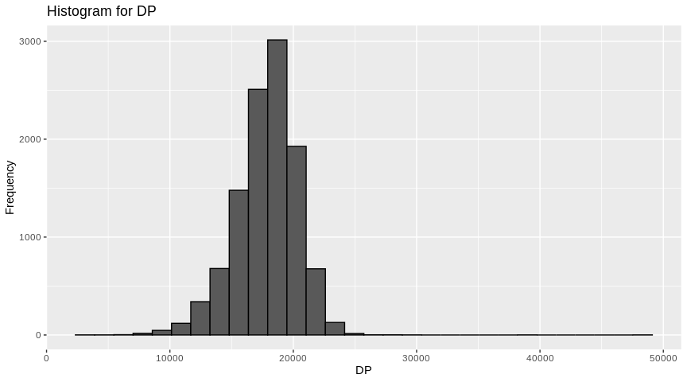

A sparklyr extension for Hail
================

[Hail](https://hail.is/) is an open-source, general-purpose,
Python-based data analysis tool with additional data types and methods
for working with genomic data. Hail is built to scale and has
first-class support for multi-dimensional structured data, like the
genomic data in a genome-wide association study (GWAS). Hail is exposed
as a Python library, using primitives for distributed queries and linear
algebra implemented in Scala, Spark, and increasingly C++.

The `sparkhail` is a R extension using
[sparklyr](https://spark.rstudio.com/) package. The idea is to help R
users to use Hail functionalities with the well know
[tidyverse](https://www.tidyverse.org/) sintax. In this README we are
going to reproduce the [GWAS
tutorial](https://hail.is/docs/0.2/tutorials/01-genome-wide-association-study.html)
using `sparkhail`, `sparklyr`, `dplyr` and `ggplot2`.

## Installation

``` r
install.packages("devtools")
devtools::install_github("samuelmacedo83/sparkhail")
```

## Read a matrix table

The data in Hail is naturally represented as a Hail
[MatrixTable](https://hail.is/docs/0.2/hail.MatrixTable.html#hail.MatrixTable).
The `sparkhail` converts the MatrixTable to dataframe, in this way is
easier to manipulate the data using `dplyr`.

``` r
library(sparkhail)
library(sparklyr)

sc <- spark_connect(master = "local", version = "2.4", config = hail_config())

hl <- hail_context(sc)
mt <- hail_read_matrix(hl, system.file("extdata/1kg.mt", package = "sparkhail"))
```

Convert to spark Data Frame as follows

``` r
df <- hail_dataframe(mt)
```

## Getting to know our data

You can see the data structure using `glimpse()`.

``` r
library(dplyr)
glimpse(df)
```

    ## Observations: ??
    ## Variables: 7
    ## Database: spark_connection
    ## $ locus   <chr> "1:904165", "1:909917", "1:986963", "1:1563691", "1:1707…
    ## $ alleles <list> [["G", "A"], ["G", "A"], ["C", "T"], ["T", "G"], ["T", …
    ## $ rsid    <chr> NA, NA, NA, NA, NA, NA, NA, NA, NA, NA, NA, NA, NA, NA, …
    ## $ qual    <dbl> 52346.37, 1576.94, 398.06, 1090.75, 93517.82, 736.40, 14…
    ## $ filter  <list> [NA, NA, NA, NA, NA, NA, NA, NA, NA, NA, NA, NA, NA, NA…
    ## $ info    <list> [[[518], [0.103], 5020, -3.394, -0.17, 17827, FALSE, 2.…
    ## $ entries <list> [[[4, [4, 0], 4, 12, [0, 12, 147]], [4, [8, 0], 8, 24, …

It’s important to have easy ways to slice, dice, query, and summarize a
dataset. The conversion to dataframe is a good way to use `dplyr` verbs.
Let’s see some examples.

``` r
df %>% 
  dplyr::select(locus, alleles) %>% 
  head(5)
```

    ## # Source: spark<?> [?? x 2]
    ##   locus     alleles   
    ##   <chr>     <list>    
    ## 1 1:904165  <list [2]>
    ## 2 1:909917  <list [2]>
    ## 3 1:986963  <list [2]>
    ## 4 1:1563691 <list [2]>
    ## 5 1:1707740 <list [2]>

Here is how to peek at the first few sample IDs:

``` r
s <- hail_ids(mt)
s
```

    ## # Source: spark<s> [?? x 1]
    ##    s      
    ##    <chr>  
    ##  1 HG00096
    ##  2 HG00099
    ##  3 HG00105
    ##  4 HG00118
    ##  5 HG00129
    ##  6 HG00148
    ##  7 HG00177
    ##  8 HG00182
    ##  9 HG00242
    ## 10 HG00254
    ## # … with more rows

The genotype calls are in `entries` column and we can see it using
`hail_entries()` function. This
[function](https://github.com/samuelmacedo83/sparkhail/blob/master/R/hail_entries.R)
selects and explodes the data frame using `sparklyr.nested`.

``` r
hail_entries(df)
```

    ## # Source: spark<?> [?? x 5]
    ##     call ad              dp    gq pl          
    ##    <int> <list>       <int> <int> <list>      
    ##  1     4 <list [284]>     4    12 <list [284]>
    ##  2     4 <list [284]>     4    24 <list [284]>
    ##  3     4 <list [284]>     4    23 <list [284]>
    ##  4     4 <list [284]>     4    21 <list [284]>
    ##  5     4 <list [284]>     4    15 <list [284]>
    ##  6     4 <list [284]>     4    11 <list [284]>
    ##  7     4 <list [284]>     4     6 <list [284]>
    ##  8     4 <list [284]>     4    14 <list [284]>
    ##  9     4 <list [284]>     4    15 <list [284]>
    ## 10     4 <list [284]>     4    39 <list [284]>
    ## # … with more rows

## Adding column fields

A Hail MatrixTable can have any number of row fields and column fields
for storing data associated with each row and column. Annotations are
usually a critical part of any genetic study. Column fields are where
you’ll store information about sample phenotypes, ancestry, sex, and
covariates. Row fields can be used to store information like gene
membership and functional impact for use in QC or analysis.

The file provided contains the sample ID, the population and
“super-population” designations, the sample sex, and two simulated
phenotypes (one binary, one discrete).

This file is a standard text file and can be imported using `sparklyr`.

``` r
annotations <- spark_read_csv(sc, "table", 
                              path = system.file("extdata/1kg_annotations.txt",
                                                 package = "sparkhail"),
                              overwrite = TRUE, 
                              delimiter = "\t")
```

A good way to peek at the structure of a Table is to look at its schema.

``` r
glimpse(annotations)
```

    ## Observations: ??
    ## Variables: 6
    ## Database: spark_connection
    ## $ Sample              <chr> "NA19784", "NA19102", "HG00141", "HG01890", …
    ## $ Population          <chr> "MXL", "YRI", "GBR", "ACB", "GBR", "GIH", "S…
    ## $ SuperPopulation     <chr> "AMR", "AFR", "EUR", "AFR", "EUR", "SAS", "S…
    ## $ isFemale            <lgl> FALSE, TRUE, FALSE, FALSE, TRUE, TRUE, TRUE,…
    ## $ PurpleHair          <lgl> FALSE, FALSE, FALSE, FALSE, TRUE, TRUE, FALS…
    ## $ CaffeineConsumption <int> 8, 6, 6, 8, 6, 9, 9, 5, 6, 5, 5, 6, 9, 3, 5,…

Now we’ll use this table to add sample annotations to our dataset. To
merge these data we can use joins.

``` r
annotations_sample <- inner_join(s, annotations, by = c("s" = "Sample"))
```

## Query functions

We will start by looking at some statistics of the information in our
data. We can aggregate using `group_by()` and count the number of
occurrences using `tally()`.

``` r
annotations %>%
  group_by(SuperPopulation) %>%
  tally()
```

    ## # Source: spark<?> [?? x 2]
    ##   SuperPopulation     n
    ##   <chr>           <dbl>
    ## 1 AFR              1018
    ## 2 AMR               535
    ## 3 SAS               661
    ## 4 EUR               669
    ## 5 EAS               617

We can use `sdf_describe()` to see the summary statistics of the data.

``` r
sdf_describe(annotations)
```

    ## # Source: spark<?> [?? x 5]
    ##   summary Sample  Population SuperPopulation CaffeineConsumption
    ##   <chr>   <chr>   <chr>      <chr>           <chr>              
    ## 1 count   3500    3500       3500            3500               
    ## 2 mean    <NA>    <NA>       <NA>            6.219714285714286  
    ## 3 stddev  <NA>    <NA>       <NA>            1.93905718305461   
    ## 4 min     HG00096 ACB        AFR             3                  
    ## 5 max     NA21144 YRI        SAS             10

However, these metrics aren’t perfectly representative of the samples in
our dataset. Here’s why:

``` r
sdf_nrow(annotations)
```

    ## [1] 3500

``` r
sdf_nrow(annotations_sample)
```

    ## [1] 284

Since there are fewer samples in our dataset than in the full thousand
genomes cohort, we need to look at sample annotations on the dataset.

``` r
annotations_sample %>%
  group_by(SuperPopulation) %>%
  tally()
```

    ## # Source: spark<?> [?? x 2]
    ##   SuperPopulation     n
    ##   <chr>           <dbl>
    ## 1 AFR                76
    ## 2 AMR                34
    ## 3 SAS                55
    ## 4 EAS                72
    ## 5 EUR                47

``` r
sdf_describe(annotations)
```

    ## # Source: spark<?> [?? x 5]
    ##   summary Sample  Population SuperPopulation CaffeineConsumption
    ##   <chr>   <chr>   <chr>      <chr>           <chr>              
    ## 1 count   3500    3500       3500            3500               
    ## 2 mean    <NA>    <NA>       <NA>            6.219714285714286  
    ## 3 stddev  <NA>    <NA>       <NA>            1.93905718305461   
    ## 4 min     HG00096 ACB        AFR             3                  
    ## 5 max     NA21144 YRI        SAS             10

Let’s see another example, now we are going to calculate the counts of
each of the 12 possible unique SNPs (4 choices for the reference base \*
3 choices for the alternate base). To do this, we need to get the
alternate allele of each variant and then count the occurences of each
unique ref/alt pair. The alleles column is nested, because of this, we
need to separete this column using `sdf_separate_column()`.

``` r
df %>% 
  sdf_separate_column("alleles") %>% 
  group_by(alleles_1, alleles_2) %>% 
  tally() %>% 
  arrange(-n)
```

    ## # Source:     spark<?> [?? x 3]
    ## # Groups:     alleles_1
    ## # Ordered by: -n
    ##    alleles_1 alleles_2     n
    ##    <chr>     <chr>     <dbl>
    ##  1 C         T          2436
    ##  2 G         A          2387
    ##  3 A         G          1944
    ##  4 T         C          1879
    ##  5 C         A           496
    ##  6 G         T           480
    ##  7 T         G           468
    ##  8 A         C           454
    ##  9 C         G           150
    ## 10 G         C           112
    ## # … with more rows

It’s nice to see that we can actually uncover something biological from
this small dataset: we see that these frequencies come in pairs. C/T and
G/A are actually the same mutation, just viewed from from opposite
strands. Likewise, T/A and A/T are the same mutation on opposite
strands. There’s a 30x difference between the frequency of C/T and A/T
SNPs. Why?

The last example, what about genotypes? Hail can query the collection of
all genotypes in the dataset, and this is getting large even for our
tiny dataset. Our 284 samples and 10,000 variants produce 10 million
unique genotypes. Let’s plot this using the `ggplot2` package.

``` r
library(ggplot2)
library(sparklyr.nested) # to access DP nested in info column

df %>% 
  sdf_select(DP = info.DP) %>% 
  collect() %>% 
  ggplot() +
  aes(x = DP) +
  geom_histogram(col=I("black")) + 
  labs(title="Histogram for DP", y="Frequency")
```

<!-- -->

## Cleanup

Then disconenct from Spark and Hail,

``` r
spark_disconnect(sc)
```

    ## NULL
